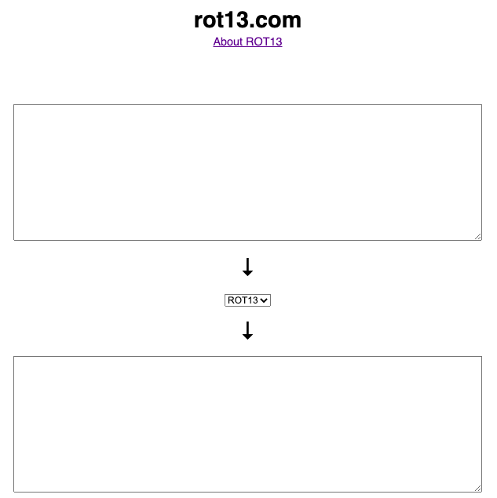

# ROT13-Cipher
## Computer Code

### Website that can encode using ROT13
This [website](https://rot13.com/) is the ROT13 website, where you can easily encrypt your message with ROT13. The website is actually quite easy to use, you dont even have to click a button for it to switch your text, it updates live. All you have to do is put the text you want to switch into ROT13 into the upper box and watch it get encrypted just like that.

### Is there and easy "decode" available?
Yes there is an easy decode avalible. If you search on google there are a number of websites that will decode ROT13 for you.

[I found this website where you can decode](http://practicalcryptography.com/ciphers/rot13-cipher/)

## [Hub](README.md)
